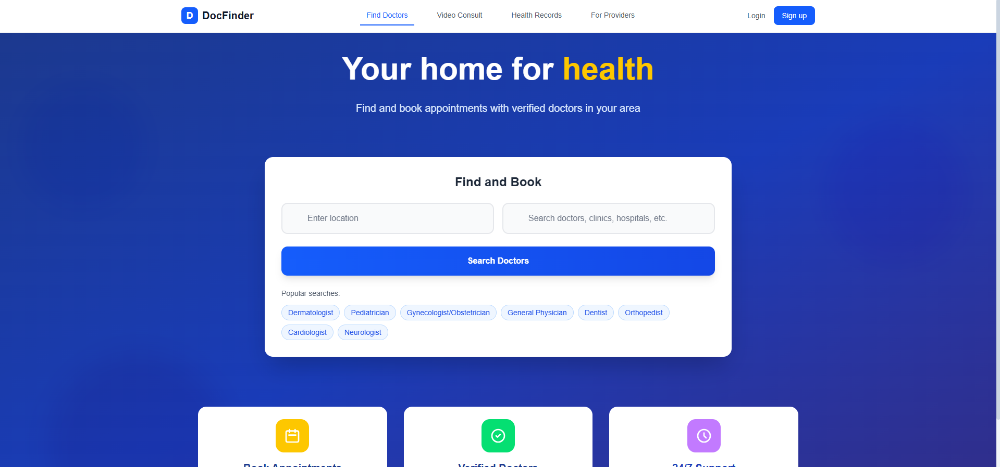
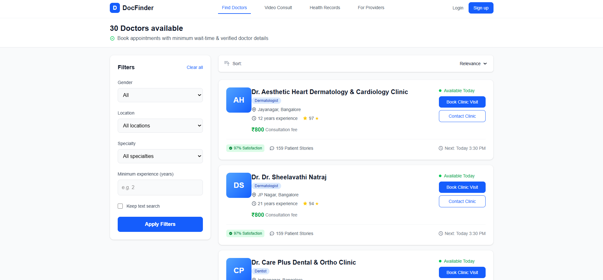

# 🩺 Doctor Finder App

*A modern, responsive doctor search & listing application built with Next.js, TypeScript, Node.js, Express, and MongoDB Atlas - providing a Practo-like experience for finding healthcare professionals.*

---

## 📸 Screenshots

### Homepage

*Clean, intuitive search interface with location and specialty filters*

### Doctor Listing Page

*Comprehensive doctor listings with advanced filtering and sorting options*

---

## 🌟 Features

### 🔍 Smart Search & Discovery
- **Location-aware search** with intelligent autocomplete
- **Real-time suggestions** for doctors, specialties, and locations
- **Advanced filtering** by location, specialty, gender, and experience
- **Multiple sorting options** - by experience, rating, or relevance

### 👩‍⚕️ Doctor Management
- **Comprehensive doctor profiles** with ratings and patient stories
- **Availability tracking** and fee information
- **Gender-based filtering** for patient preferences
- **Experience-based search** with minimum years filter

### 💻 Technical Excellence
- **Mobile-first responsive design** with Tailwind CSS
- **Loading skeletons** and smooth animations for better UX
- **RESTful API architecture** with comprehensive endpoints
- **MongoDB Atlas integration** with optimized queries

---

## 🛠️ Tech Stack

| Category | Technologies |
|----------|-------------|
| **Frontend** | Next.js 13+, TypeScript, React, Tailwind CSS |
| **Backend** | Node.js, Express.js, Mongoose ODM |
| **Database** | MongoDB Atlas |
| **Development** | nodemon, dotenv, ESLint, Prettier |

---

## 📁 Project Structure

```
doctor-finder-app/
│
├── backend/
│   ├── config/
│   │   └── db.js                    # MongoDB connection setup
│   ├── controllers/
│   │   └── doctorController.js      # Business logic for doctor operations
│   ├── models/
│   │   └── Doctor.js                # MongoDB schema and model
│   ├── routes/
│   │   └── doctorRoutes.js          # API route definitions
│   ├── seed.js                      # Database seeding script
│   ├── app.js                       # Express application setup
│   ├── server.js                    # Server entry point
│   ├── .env                         # Environment variables
│   └── package.json
│
├── frontend/
│   ├── pages/
│   │   ├── index.tsx                # Homepage with search
│   │   └── doctors/
│   │       └── index.tsx            # Doctor listing page
│   ├── components/                  # Reusable UI components
│   ├── styles/                      # Global styles and Tailwind config
│   └── public/
│       └── screenshots/             # Application screenshots
│
└── screenshots/                     # Project screenshots for README
    ├── homepage.png
    └── doctor-listing.png
```

---

## 🚀 Quick Start Guide

### Prerequisites
- Node.js 16+ and npm
- MongoDB Atlas account
- Git

### Backend Setup

1. **Clone and navigate to backend**
   ```bash
   git clone <repository-url>
   cd doctor-finder-app/backend
   ```

2. **Install dependencies**
   ```bash
   npm install
   ```

3. **Environment configuration**
   
   Create `.env` file in the backend directory:
   ```env
   MONGO_URI=mongodb+srv://<username>:<password>@<cluster>.mongodb.net/doctordb?retryWrites=true&w=majority
   PORT=5000
   NODE_ENV=development
   ```

4. **Seed the database** (Recommended for testing)
   ```bash
   node seed.js
   ```
   *This populates your database with sample doctor data*

5. **Start the development server**
   ```bash
   npm run dev
   ```
   
   Backend runs at: `http://localhost:5000`

### Frontend Setup

1. **Navigate to frontend directory**
   ```bash
   cd ../frontend
   ```

2. **Install dependencies**
   ```bash
   npm install
   ```

3. **Start development server**
   ```bash
   npm run dev
   ```
   
   Frontend runs at: `http://localhost:3000`

---

## 📡 API Documentation

Base URL: `http://localhost:5000/api`

### 🔍 Search & Filter Endpoints

#### Get All Doctors
```http
GET /api/doctors
```

**Query Parameters:**
| Parameter | Type | Description | Example |
|-----------|------|-------------|---------|
| `location` | string | Filter by location (partial match) | `JP Nagar` |
| `specialty` | string | Filter by medical specialty | `Dermatologist` |
| `gender` | string | Filter by gender (`Male`, `Female`, `Mixed`) | `Female` |
| `minExp` | number | Minimum years of experience | `10` |
| `sort` | string | Sort order (`experience`, `rating`, `relevance`) | `rating` |

**Example Requests:**
```bash
# Get all doctors
GET /api/doctors

# Filter by location and specialty
GET /api/doctors?location=JP%20Nagar&specialty=Dermatologist

# Filter with experience and sorting
GET /api/doctors?gender=Female&minExp=10&sort=experience
```

#### Search Autocomplete
```http
GET /api/doctors/search?q=<query>
```

**Example:**
```bash
GET /api/doctors/search?q=cardio
```

#### Get Filter Options
```http
GET /api/doctors/filters
```
*Returns available locations, specialties, and other filter options*

#### Get Doctor by ID
```http
GET /api/doctors/:id
```

**Example:**
```bash
GET /api/doctors/648f1e6a2b9b7a0012345678
```

### 📋 Response Format

**Doctor Object Structure:**
```json
{
  "_id": "648f1e6a2b9b7a0012345678",
  "name": "Dr. Sheelavathi Natraj",
  "type": "doctor",
  "specialty": "Dermatologist",
  "experience": 21,
  "location": "JP Nagar, Bangalore",
  "fee": 800,
  "rating": 94,
  "stories": 1506,
  "available": true,
  "gender": "Female"
}
```

---

## 🧪 Testing

### Using Postman
1. Import the API collection or test endpoints individually
2. Verify the backend is running on `http://localhost:5000`
3. Test the main endpoints:
   - `GET /api/doctors` - Should return sample data
   - `GET /api/doctors/search?q=test` - Should return search results
   - `GET /api/doctors/filters` - Should return filter options

### Sample Test Scenarios
- **Search functionality**: Test autocomplete with partial queries
- **Filtering**: Combine multiple filters (location + specialty + gender)
- **Sorting**: Verify different sort orders work correctly
- **Error handling**: Test with invalid IDs or malformed requests

---

## 🔄 Frontend Integration

### Search Flow
1. **Homepage search** → Navigate to `/doctors` with query parameters
2. **Listing page** → Read URL params and fetch from API
3. **Filter updates** → Update URL and refetch data

### URL Structure Examples
```
/doctors?location=JP%20Nagar&specialty=Dermatologist&sort=rating
/doctors?gender=Female&minExp=5
```

---

## 🚀 Deployment

### Backend Deployment
- Deploy to Heroku, Vercel, or DigitalOcean
- Ensure MongoDB Atlas whitelist includes deployment IP
- Set environment variables in deployment platform

### Frontend Deployment
- Deploy to Vercel (recommended for Next.js)
- Update API base URL for production

---

## 🛠️ Available Scripts

### Backend Scripts
```json
{
  "dev": "nodemon server.js",      // Development with auto-reload
  "start": "node server.js",       // Production
  "seed": "node seed.js"           // Populate database
}
```

### Frontend Scripts
```json
{
  "dev": "next dev",               // Development server
  "build": "next build",           // Production build
  "start": "next start"            // Production server
}
```

---

## 📈 Future Enhancements

- [ ] Doctor profile pages with detailed information
- [ ] Appointment booking system
- [ ] User authentication and profiles
- [ ] Reviews and ratings system
- [ ] Real-time availability updates
- [ ] Payment integration
- [ ] Mobile app development

---

## 🤝 Contributing

1. Fork the repository
2. Create your feature branch (`git checkout -b feature/AmazingFeature`)
3. Commit your changes (`git commit -m 'Add some AmazingFeature'`)
4. Push to the branch (`git push origin feature/AmazingFeature`)
5. Open a Pull Request

---

## 📞 Support

If you encounter any issues or have questions:

1. Check the [Issues](https://github.com/yourusername/doctor-finder-app/issues) page
2. Create a new issue with detailed description
3. Contact the maintainer

---

## 📜 License

MIT © [Rhydam Panda](https://github.com/rhydampanda)

---

## 🙏 Acknowledgments

- Thanks to the healthcare community for inspiration
- MongoDB Atlas for reliable database hosting
- Vercel team for excellent Next.js deployment platform

---

*Ready to transform healthcare discovery! 🏥✨*

---

**Built with ❤️ by [Rhydam Panda](https://github.com/rhydampanda)**